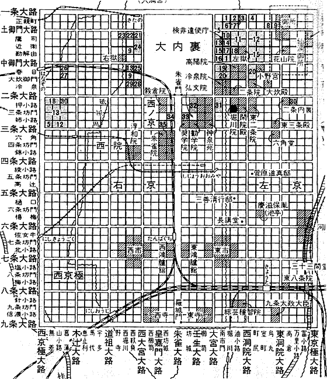

# HeiankyoView
An fast algorithm to visualize tree structures.  
My past work in B.S.

## What is Heian-kyo?
Heian-kyo was one of the several former names for the city now known as Kyoto.  
Please see the [wikipedia page](https://en.wikipedia.org/wiki/Heian-ky%C5%8D).  

## So, what is HeiankyoView?
This algorithm is named HeiankyoView becaused the visulization image is just like the
map of Heian-kyo.  

HeiankyoView is originally developed by Takayuki Itoh and
the algorithm is improved later by a prominent bachelor student,
Akira Hayakawa of Kyoto university.
 
## Developer Info
Akira Hayakawa(@akiradeveloper)  
e-mail: ruby.wktk@gmail.com
